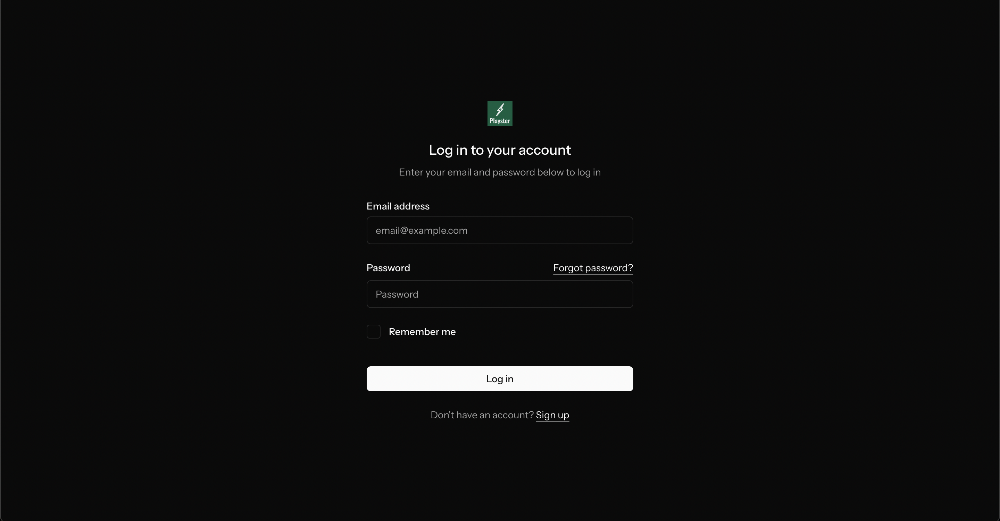
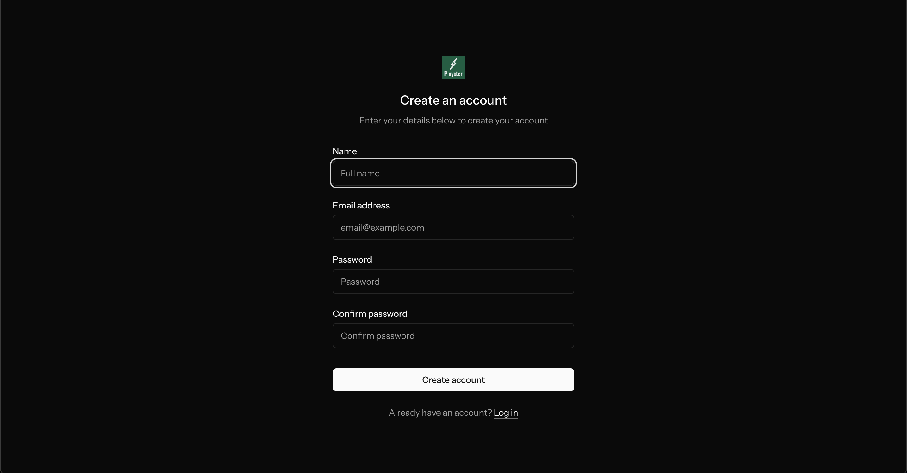
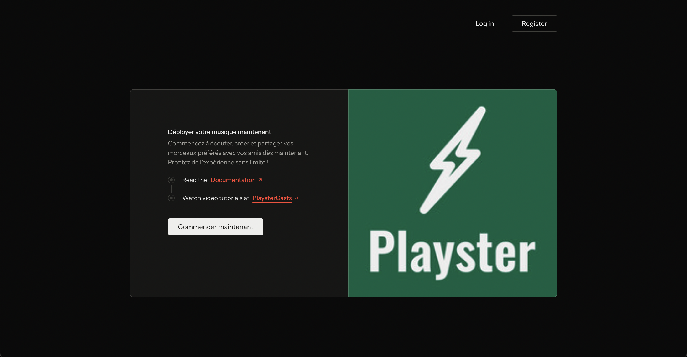
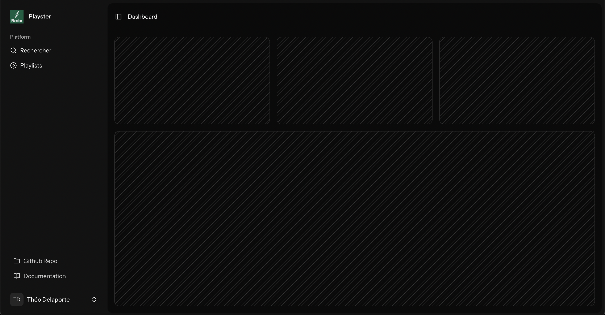

# laravel-playster
Exemple de résultat qui pourrait être attendu en utilisant le framework Laravel pour un TP sur la conception d'une plateforme de streaming musicale.

## Aperçu de la plateforme

V0.1 - Première version login/register/dashboard

### Page de connexion

### Page d'inscription

### Page de pré-connexion

### Dashboard

